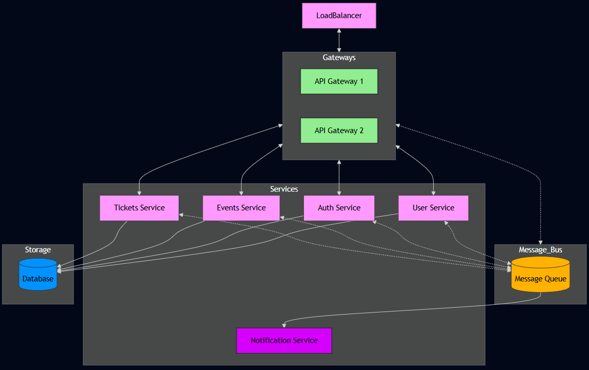
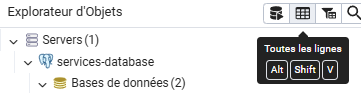
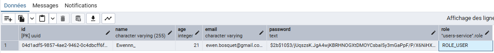
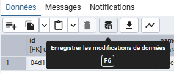

# 4WEBD - Projet final - Tickly (Ewen Bosquet)

[GitHub repository](https://github.com/Ewennnn/Tickly)

Tickly est une application de gestion de billets pour événements qui permet de gérer des événements et l'inscription d'utilisateurs authentifiés à ces événements.

L'application est construite avec une **architecture en microservices**, chaque fonctionnalité est encapsulée dans un service indépendant pour une plus grande scalabilité et évolutivité.

## Technologies utilisées

- **RabbitMQ** : élément central du projet, assurant la communication entre les services.
- **PostgreSQL** : base de données utilisée pour stocker les données de chaque service.
- **Node.js & TypeScript** : technologies employées pour le développement des services et de l’application frontend.
- **Docker** : utilisé pour conteneuriser les services et orchestrer l’ensemble via le fichier [compose.yml](compose.yml).
- **Nodemailer** : pour envoyer les emails, facilement configurable avec un serveur SMTP public tel que Gmail
- **Nginx** : utilisé pour mettre en place un **reverse proxy** faisant passerelle et **load-balancer** entre les instances d'api-gateway et les clients

## Configurations

Tous les services se configurent avec des variables d'environnement. Un fichier `.env.example` donnant la configuration attendue est diponible pour chaque service :
- [api-gateway](./apps/api-gateway/.env.example)
- [auth-service](./apps/auth-service/.env.example)
- [events-service](./apps/events-service/.env.example)
- [notification-service](./apps/notification-service/.env.example)
- [tickets-service](./apps/tickets-service/.env.example)
- [user-service](./apps/user-service/.env.example)

## Présentation des services



Tous les services communiquent entre eux avec des queues **RabbitMQ**.

### API Gateway

Service **stateless** permettant d'exposer des endpoints HTTP pour communiquer avec les micro-services.

### User service

Service de gestion des utilisateurs (création, consultation, édition, suppression).

### Auth service

Service de gestion d'authentification des utilisateurs (connexion, rafraichissement des tokens, déconnexion).

### Events service

Service de gestion des évènements (création, consultation, édition, suppression).

### Tickets service

Service de gestion des tickets. Permet aux utilisateurs de s'inscrire à un évènement (création, consultation, suppression).

### Notification service

Service d'envoi de mail. Ce service est unidirectionnel, il ne retourne jamais de réponse aux services qui le contactent.

### Payments service

Ce service n'a pas été implémenté par manque de temps. La logique d'implémentation sera la même que pour les services ci-dessus

## Lancement du projet

Chaque service possède un script NPM `npm run dev` permettant de l'exécuter en mode développement. Il se relancera à chaque modification dans le code.

Un `Dockerfile` est disponible pour chaque service permettant de fabriquer une image Docker et ainsi pouvoir les conteneuriser.

Une configuration Docker compose est disponible à la racine du projet [compose.yml](compose.yml).
Elle permet de fabriquer les images de chaque service et de les déployer dans un environnement totalement pré-configuré.
Le script [compose-cleanup.sh](compose-cleanup.sh) permet de détruire tous les conteneurs déployés depuis le fichier [compose.yml](compose.yml) et supprimé toutes les images fabriquées pour rendre votre environnement Docker local propre.

Le lancement complet du projet peut prendre quelques minutes à l'issue des quelles vous pouvez vous rendre sur l'interface web de l'application disponible à l'addresse [http://localhost:4000](http://localhost:4000). 
```sh
docker compose up -d --build
```

### Services externes

Une fois lancée, la configuration [compose.yml](compose.yml) permet d'accéder aux services suivants :
- [Interface RabbitMQ](http://localhost:15672/)
  - user: **guest**
  - password: **guest**
- [Interface pgAdmin](http://localhost:5050/)
  - user: **admin@admin.com**
  - password: **admin**

### Accès à la base de données

Étant donné qu'il n'y a pas de données préchargés, il vous sera utile de modifier votre compte pour avoir accès au panel admin de l'application.
Pour cela, suivez ces étapes :
1. Une fois votre compte créer depuis l'interface principale de l'application, accédez à l'interface pgAdmin avec les identifiants donnés ci-dessus.
2. Cliquez sur `> Servers` en haut à gauche
3. Dans la pop-up qui s'est ouverte, taper le mot de passe de la base de données : **root**
4. Dans le menu à gauche cliquez successivement sur :
   - Bases de données (2)
   - public
   - Schémas (6)
   - Tables (1)
   - users
   - Une fois sélectionnée, cliquer sur 'Toutes les lignes' 
   - Vous devriez voir une ligne (ou plusieurs) avec vos utilisateur 
   - Double, cliquez sur **ROLE_USER** et modifiez cette valeur par **ROLE_ADMIN** puis cliquez sur OK
   - Cliquez ensuite sur 'Enregistrer les modifications de données' 
   - Félicitations, votre compte est maintenant administrateur !

## Axes d'amélioration

- Centraliser les fichiers communs dans une bibliothèque partagée entre les micro-services au lieu de les dupliquer (ex. : `rabbitmq.ts`).
- Simplifier les Dockerfile et le processus de build, actuellement trop complexes sans réelle utilité.
- Remplacer Drizzle par un ORM plus adapté aux migrations automatiques, notamment dans un environnement conteneurisé.
- Sécuriser l'accès à RabbitMQ, qui a été mis en place en privilégiant le bon fonctionnement au détriment de la sécurité.
- Améliorer la structure et l’optimisation du frontend, notamment en évitant de répéter l’appel à la gateway sur chaque page pour récupérer l’utilisateur authentifié.
- Proposer une documentation plus poussée de l'application, notamment une interface OpenAPI et la structure des objets échangés entre les micro-services.

## Disclaimer

Certaines fonctionnalités peuvent manquer dans l'interface web du projet, mais elles sont toutes fonctionnels d'un point de vue backend.
Une collection [Yaak](docs/yaak.4webd-tickly.json), outil équivalent à Postman open source est disponible pour tester chaque endpoint.